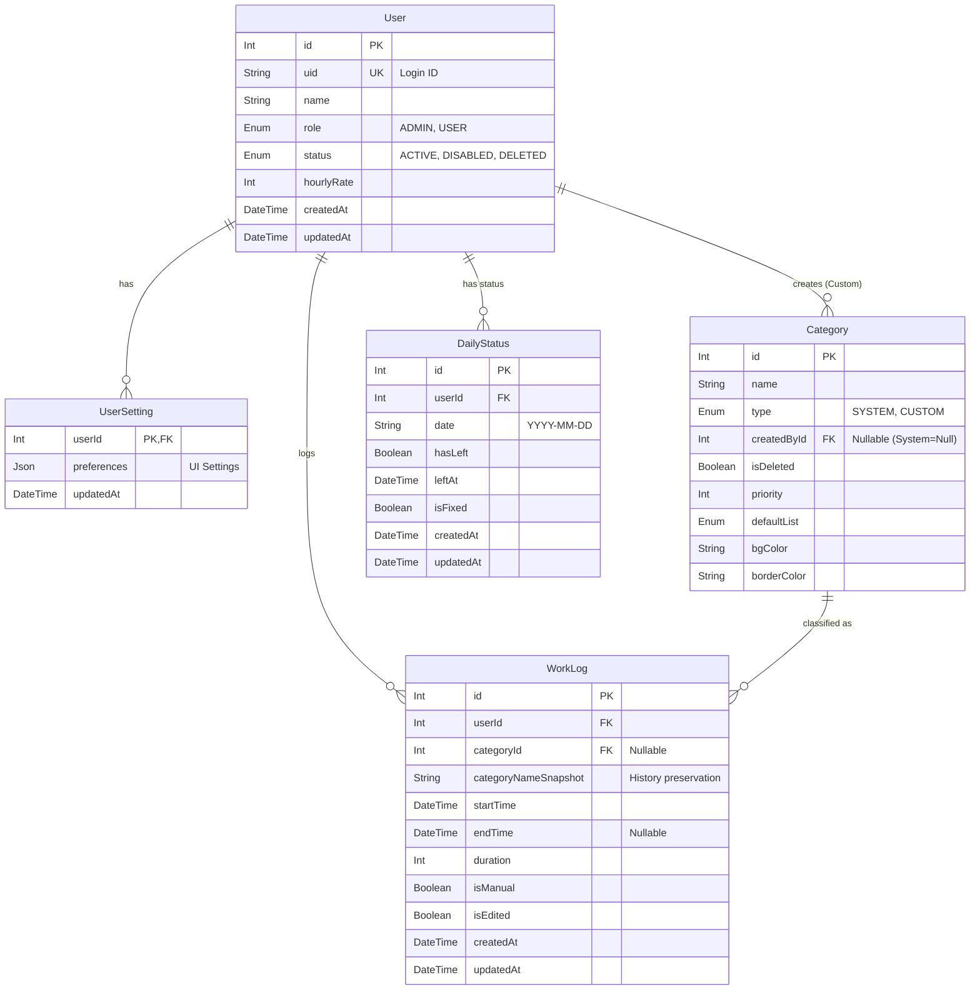

# 業務時間計測・管理システム (Zimmeter) DB定義書

**Version**: 2.0
**Date**: 2024-12-18

## 1. ER図 (概念)

## 2. テーブル定義

### 2.1 users (ユーザー)
システムを利用するユーザー情報を管理する。

| カラム名 | 型 | 制約 | 説明 |
| :--- | :--- | :--- | :--- |
| id | Int | PK, AutoInc | 内部ID |
| uid | String | Unique | ログインID (Firebase UID等ではなく独自のID文字列) |
| name | String | | 表示名 |
| role | Enum | Default: USER | 権限 (ADMIN: 管理者, USER: 一般) |
| status | Enum | Default: ACTIVE | 状態 (ACTIVE, DISABLED, DELETED) |
| hourlyRate | Int | Default: 0 | 時給単価（概算用） |
| createdAt | DateTime | Default: now() | 作成日時 |
| updatedAt | DateTime | UpdatedAt | 更新日時 |

### 2.2 user_settings (ユーザー設定)
ユーザーごとのUI設定などを管理する。`users`テーブルと1対1の関係。

| カラム名 | 型 | 制約 | 説明 |
| :--- | :--- | :--- | :--- |
| userId | Int | PK, FK(users.id) | ユーザーID |
| preferences | Json | Nullable | 設定JSON (ボタン順序、非表示設定など) |
| updatedAt | DateTime | UpdatedAt | 更新日時 |

### 2.3 categories (業務カテゴリ)
業務内容の分類（タスク）を管理する。

| カラム名 | 型 | 制約 | 説明 |
| :--- | :--- | :--- | :--- |
| id | Int | PK, AutoInc | カテゴリID |
| name | String | | カテゴリ名 |
| type | Enum | | 種別 (SYSTEM: 全体共通, CUSTOM: 個人用) |
| createdById | Int | FK(users.id), Nullable | 作成者ID (Systemの場合はNull) |
| isDeleted | Boolean | Default: false | 論理削除フラグ |
| priority | Int | Default: 0 | 表示順序（数値が大きいほど優先など、アプリ仕様による） |
| defaultList | Enum | Default: SECONDARY | 初期表示リスト (PRIMARY, SECONDARY, HIDDEN) |
| bgColor | String | Nullable | 背景色 (Tailwindクラスまたはカラーコード) |
| borderColor | String | Nullable | 枠線色 |

### 2.4 work_logs (業務ログ)
ユーザーの業務活動履歴を記録する。

| カラム名 | 型 | 制約 | 説明 |
| :--- | :--- | :--- | :--- |
| id | Int | PK, AutoInc | ログID |
| userId | Int | FK(users.id) | ユーザーID |
| categoryId | Int | FK(categories.id), Nullable | カテゴリID (マスタ参照用) |
| categoryNameSnapshot | String | | **スナップショット**: 記録時点のカテゴリ名 |
| startTime | DateTime | Default: now() | 開始日時 |
| endTime | DateTime | Nullable | 終了日時 (進行中はNull) |
| duration | Int | Nullable | 所要時間(秒)。終了時に計算して格納 |
| isManual | Boolean | Default: false | 手動作成フラグ |
| isEdited | Boolean | Default: false | 編集済みフラグ |
| createdAt | DateTime | Default: now() | 作成日時 |
| updatedAt | DateTime | UpdatedAt | 更新日時 |

### 2.5 daily_statuses (日次ステータス)
ユーザーごとの日次の状態（退社済みかどうか等）を管理する。

| カラム名 | 型 | 制約 | 説明 |
| :--- | :--- | :--- | :--- |
| id | Int | PK, AutoInc | ID |
| userId | Int | FK(users.id) | ユーザーID |
| date | String | | 対象日 (YYYY-MM-DD形式) |
| hasLeft | Boolean | Default: false | 退社済みフラグ |
| leftAt | DateTime | Nullable | 退社時刻 |
| isFixed | Boolean | Default: false | 補正済みフラグ（過去日の未退社を修正した場合など） |
| createdAt | DateTime | Default: now() | 作成日時 |
| updatedAt | DateTime | UpdatedAt | 更新日時 |

## 3. Enum定義

### Role
*   **ADMIN**: 全機能にアクセス可能。
*   **USER**: 自身のログ管理およびCustomカテゴリ管理のみ可能。

### UserStatus
*   **ACTIVE**: 通常利用可能。
*   **DISABLED**: 一時的に利用不可（ログイン不可、画面ロック）。
*   **DELETED**: 削除扱い（ログイン不可、データは保持）。

### CategoryType
*   **SYSTEM**: 管理者が管理する共通カテゴリ。
*   **CUSTOM**: ユーザー個人が作成したカテゴリ。

### DefaultListType
*   **PRIMARY**: メインのリストに表示。
*   **SECONDARY**: サブリスト（「その他」など）に表示。
*   **HIDDEN**: 非表示。
