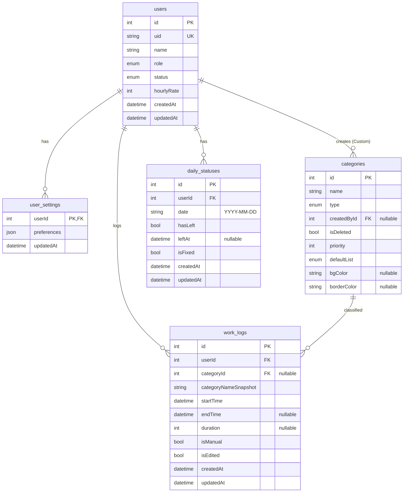

# 業務時間計測・管理システム (Zimmeter) DB定義書

**Version**: 3.0
**Date**: 2025-12-22

---

## 1. データベース環境

| 項目 | 設定値 | 備考 |
| :--- | :--- | :--- |
| RDBMS | PostgreSQL | Dockerで運用 |
| ORM | Prisma | `server/prisma/schema.prisma` を正とする |

---

## 2. ER図（概念）

---

## 3. Enum定義

### 3.1 `Role`
- **ADMIN**: 管理者
- **USER**: 一般ユーザー

### 3.2 `UserStatus`
- **ACTIVE**: 利用可能
- **DISABLED**: 無効化（ログイン不可/操作不可）
- **DELETED**: 削除扱い（ログイン不可、データ保持）

### 3.3 `CategoryType`
- **SYSTEM**: 全ユーザー共通カテゴリ（管理者が管理）
- **CUSTOM**: 個人カテゴリ（作成者のみ参照・管理）

### 3.4 `DefaultListType`
- **PRIMARY**: メインボタン
- **SECONDARY**: サブボタン
- **HIDDEN**: 非表示

---

## 4. テーブル定義

以下、Prismaの `@@map` に対応する物理名を使用する。

### 4.1 `users`（ユーザー）

| 論理名 | 物理名 | 型 | NULL | 制約/既定 | 備考 |
| :--- | :--- | :--- | :--- | :--- | :--- |
| ID | `id` | INTEGER | 不可 | PK / auto increment | 内部ID |
| ログインID | `uid` | TEXT | 不可 | UNIQUE | 簡易認証キー |
| 氏名 | `name` | TEXT | 不可 |  | 表示名 |
| 権限 | `role` | ENUM | 不可 | default USER | ADMIN/USER |
| 状態 | `status` | ENUM | 不可 | default ACTIVE | ACTIVE/DISABLED/DELETED |
| 時給単価 | `hourlyRate` | INTEGER | 可 | default 0 | 管理用 |
| 作成日時 | `createdAt` | TIMESTAMP | 不可 | default now |  |
| 更新日時 | `updatedAt` | TIMESTAMP | 不可 | updatedAt |  |

- **ユニーク制約**
  - `uid`

---

### 4.2 `user_settings`（ユーザー設定）

| 論理名 | 物理名 | 型 | NULL | 制約/既定 | 備考 |
| :--- | :--- | :--- | :--- | :--- | :--- |
| ユーザーID | `userId` | INTEGER | 不可 | PK / FK(users.id) | 1ユーザー1設定 |
| 設定JSON | `preferences` | JSON | 可 |  | ボタン配置等 |
| 更新日時 | `updatedAt` | TIMESTAMP | 不可 | updatedAt |  |

---

### 4.3 `categories`（カテゴリ）

| 論理名 | 物理名 | 型 | NULL | 制約/既定 | 備考 |
| :--- | :--- | :--- | :--- | :--- | :--- |
| ID | `id` | INTEGER | 不可 | PK / auto increment |  |
| 名称 | `name` | TEXT | 不可 |  |  |
| 種別 | `type` | ENUM | 不可 |  | SYSTEM/CUSTOM |
| 作成者ID | `createdById` | INTEGER | 可 | FK(users.id) | Customは作成者、Systemは実装上NULLでない場合もあり得る |
| 論理削除 | `isDeleted` | BOOLEAN | 不可 | default false | trueで非表示 |
| 表示順 | `priority` | INTEGER | 不可 | default 0 | 小さいほど上位（現行） |
| 初期表示先 | `defaultList` | ENUM | 不可 | default SECONDARY | PRIMARY/SECONDARY/HIDDEN |
| 背景色 | `bgColor` | TEXT | 可 |  | UI設定 |
| 枠線色 | `borderColor` | TEXT | 可 |  | UI設定 |

---

### 4.4 `work_logs`（業務ログ）

| 論理名 | 物理名 | 型 | NULL | 制約/既定 | 備考 |
| :--- | :--- | :--- | :--- | :--- | :--- |
| ID | `id` | INTEGER | 不可 | PK / auto increment |  |
| ユーザーID | `userId` | INTEGER | 不可 | FK(users.id) |  |
| カテゴリID | `categoryId` | INTEGER | 可 | FK(categories.id) | 参照用（削除後も履歴保持） |
| カテゴリ名スナップショット | `categoryNameSnapshot` | TEXT | 不可 |  | **履歴改変防止のため必須** |
| 開始日時 | `startTime` | TIMESTAMP | 不可 | default now |  |
| 終了日時 | `endTime` | TIMESTAMP | 可 |  | 計測中はNULL |
| 所要時間（秒） | `duration` | INTEGER | 可 |  | `endTime-startTime` |
| 手動作成 | `isManual` | BOOLEAN | 不可 | default false | 手動追加ログ |
| 編集済み | `isEdited` | BOOLEAN | 不可 | default false | 編集操作があったログ |
| 作成日時 | `createdAt` | TIMESTAMP | 不可 | default now |  |
| 更新日時 | `updatedAt` | TIMESTAMP | 不可 | updatedAt |  |

- **インデックス**
  - `@@index([userId, startTime])`

---

### 4.5 `daily_statuses`（日次ステータス）

| 論理名 | 物理名 | 型 | NULL | 制約/既定 | 備考 |
| :--- | :--- | :--- | :--- | :--- | :--- |
| ID | `id` | INTEGER | 不可 | PK / auto increment |  |
| ユーザーID | `userId` | INTEGER | 不可 | FK(users.id) |  |
| 対象日 | `date` | TEXT | 不可 | UNIQUE(userId,date) | `YYYY-MM-DD` |
| 退社済 | `hasLeft` | BOOLEAN | 不可 | default false |  |
| 退社時刻 | `leftAt` | TIMESTAMP | 可 |  |  |
| 補正済 | `isFixed` | BOOLEAN | 不可 | default false |  |
| 作成日時 | `createdAt` | TIMESTAMP | 不可 | default now |  |
| 更新日時 | `updatedAt` | TIMESTAMP | 不可 | updatedAt |  |

- **ユニーク制約**
  - `@@unique([userId, date])`

---

## 5. Prisma Schema（正本）

DB仕様は `server/prisma/schema.prisma` を正とする。
