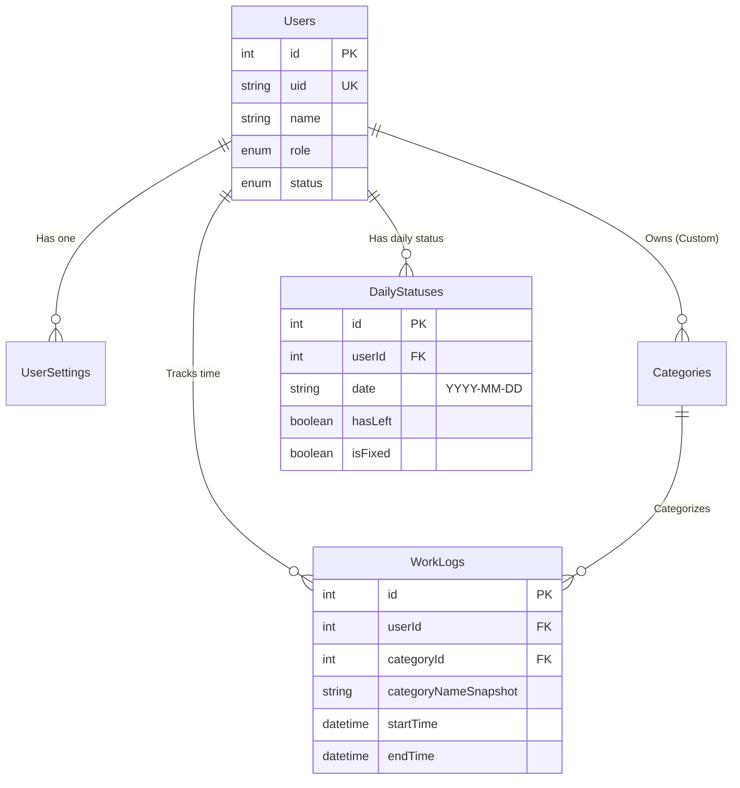

# 業務時間計測Webアプリケーション データベース定義書 (v2)

**Version**: 2.0
**Date**: 2024-12-18

## 1. データベース環境構成

| 項目 | 設定値 | 備考 |
| :--- | :--- | :--- |
| **RDBMS** | PostgreSQL 15 以上 | |
| **ORM** | Prisma | |

## 2. ER図（概念）

v2では `DailyStatus` テーブルが追加され、日次の勤務状態を独立して管理する。



## 3. テーブル定義詳細

### 3.1 `users` (ユーザーマスタ)
| 論理名 | 物理名 | 型 | 必須 | 備考 |
| :--- | :--- | :--- | :--- | :--- |
| ID | `id` | Int | 〇 | PK, AutoIncrement |
| ログインID | `uid` | String | 〇 | Unique |
| 名前 | `name` | String | 〇 | |
| 権限 | `role` | Enum | 〇 | ADMIN / USER |
| ステータス | `status` | Enum | 〇 | ACTIVE / DISABLED / DELETED |
| 単価 | `hourlyRate` | Int | - | Default: 0 |
| 作成日時 | `createdAt` | DateTime | 〇 | |
| 更新日時 | `updatedAt` | DateTime | 〇 | |

### 3.2 `categories` (業務項目マスタ)
| 論理名 | 物理名 | 型 | 必須 | 備考 |
| :--- | :--- | :--- | :--- | :--- |
| ID | `id` | Int | 〇 | PK |
| 名前 | `name` | String | 〇 | |
| 種別 | `type` | Enum | 〇 | SYSTEM / CUSTOM |
| 作成者ID | `createdById` | Int | - | FK(users) |
| 論理削除 | `isDeleted` | Boolean | 〇 | Default: false |
| 表示順 | `priority` | Int | 〇 | Default: 0 |
| 背景色 | `bgColor` | String | - | (v2追加) UI用 |
|枠線色 | `borderColor` | String | - | (v2追加) UI用 |

### 3.3 `work_logs` (作業ログ)
| 論理名 | 物理名 | 型 | 必須 | 備考 |
| :--- | :--- | :--- | :--- | :--- |
| ID | `id` | Int | 〇 | PK |
| ユーザーID | `userId` | Int | 〇 | FK(users) |
| カテゴリID | `categoryId` | Int | - | FK(categories) |
| カテゴリ名(Snap) | `categoryNameSnapshot` | String | 〇 | **履歴保存用** |
| 開始日時 | `startTime` | DateTime | 〇 | |
| 終了日時 | `endTime` | DateTime | - | |
| 経過時間 | `duration` | Int | - | 秒単位 |
| 手動作成 | `isManual` | Boolean | 〇 | (v2追加) Default: false |
| 編集済 | `isEdited` | Boolean | 〇 | (v2追加) Default: false |
| 作成日時 | `createdAt` | DateTime | 〇 | |
| 更新日時 | `updatedAt` | DateTime | 〇 | |

### 3.4 `daily_statuses` (日次ステータス) [New]
ユーザーごとの1日の勤務状態を管理する。

| 論理名 | 物理名 | 型 | 必須 | 備考 |
| :--- | :--- | :--- | :--- | :--- |
| ID | `id` | Int | 〇 | PK |
| ユーザーID | `userId` | Int | 〇 | FK(users) |
| 日付 | `date` | String | 〇 | YYYY-MM-DD形式 (JST基準) |
| 退社フラグ | `hasLeft` | Boolean | 〇 | Default: false |
| 退社時刻 | `leftAt` | DateTime | - | |
| 補正フラグ | `isFixed` | Boolean | 〇 | Default: false (管理者による修正時true) |
| 作成日時 | `createdAt` | DateTime | 〇 | |
| 更新日時 | `updatedAt` | DateTime | 〇 | |

### 3.5 `user_settings` (ユーザー設定)
| 論理名 | 物理名 | 型 | 必須 | 備考 |
| :--- | :--- | :--- | :--- | :--- |
| ユーザーID | `userId` | Int | 〇 | PK, FK(users) |
| 設定 | `preferences` | Json | - | 順序、非表示設定など |
| 更新日時 | `updatedAt` | DateTime | 〇 | |

## 4. Prisma Schema Enum定義

```prisma
enum UserStatus {
  ACTIVE
  DISABLED
  DELETED
}

enum CategoryType {
  SYSTEM
  CUSTOM
}

enum DefaultListType {
  PRIMARY
  SECONDARY
  HIDDEN
}

enum Role {
  ADMIN
  USER
}
```
